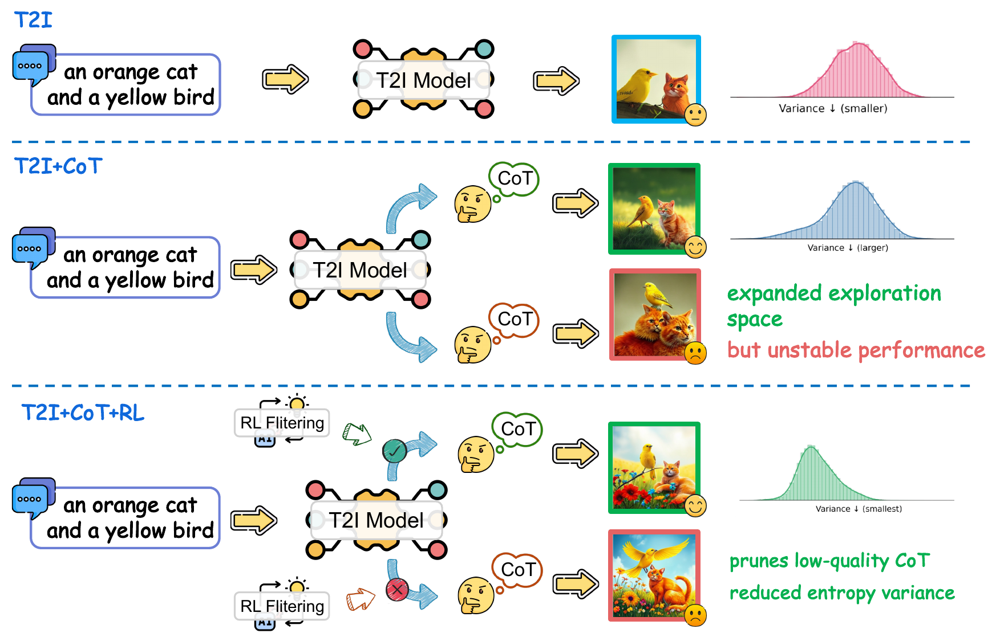
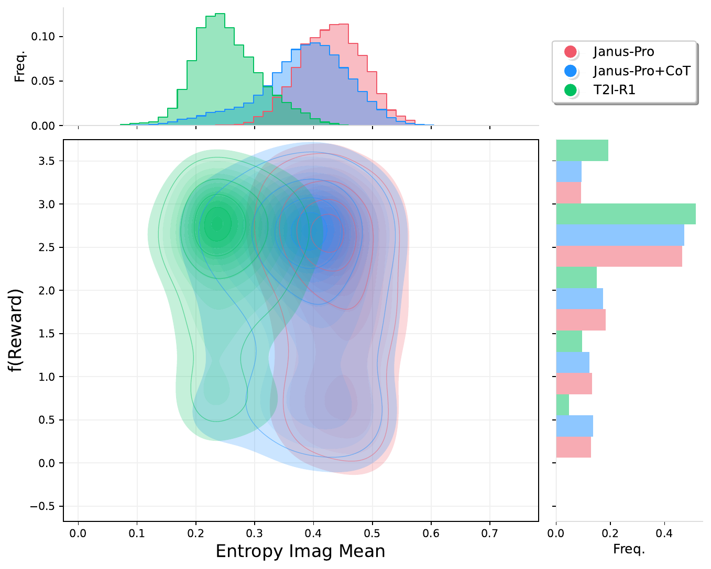

# 🌟🔥 [ICLR 2026] From Broad Exploration to Stable Synthesis: Entropy-Guided Optimization for Autoregressive Image Generation

<!-- Official repository for the paper "[From Broad Exploration to Stable Synthesis: Entropy-Guided Optimization for Autoregressive Image Generation](https://arxiv.org/pdf/2505.00703)".

[[📖 Paper](https://arxiv.org/pdf/2505.00703)] [[🤗 Model](https://huggingface.co/CaraJ/T2I-R1)] -->

<!-- <p align="center">
     <br>
</p> -->

### 💥 News
- **[2026.1.25]** EG-GRPO has been accepted by ICLR 2026! 🎉🎉
<!-- - **[2026.2.2]**  We release the [arxiv paper](...) and the repository -->
<!-- - **[2025.06.12]** T2I-R1 has achieved the best result in open-source AR-based models in [TIIF-Bench](https://a113n-w3i.github.io/TIIF_Bench/)! 🔥
- **[2025.05.24]** We release the [checkpoint](https://huggingface.co/CaraJ/T2I-R1) of T2I-R1! 🔥
- **[2025.05.23]** Our new work exploring different RL Strategies for T2I is released: [Delving into RL for Image Generation with CoT: A Study on DPO vs. GRPO](https://arxiv.org/pdf/2505.17017) 🚀
- **[2025.05.02]** We release the [arxiv paper](https://arxiv.org/pdf/2505.00703) and the training code. 🔥
- **[2025.02.28]** Our previous work for Image Generation with CoT: [*Can We Generate Images with CoT? Let's Verify and Reinforce Image Generation Step by Step*](https://arxiv.org/pdf/2501.13926?) is accepted by **CVPR 2025** 🎉 -->

## 👀 Exploring the interaction between CoT's exploration and RL's optimization

Combining Chain-of-Thought (CoT) with Reinforcement Learning (RL) improves text-to-image (T2I) generation, yet the underlying interaction between CoT's exploration and RL's optimization remains unclear. In this project, We present a systematic entropy-based analysis and and derive several insightful findings. Based on the findings, we propose **Entropy-Guided Group Relative Policy Optimization (EG-GRPO)**, a fine-tuning strategy that reallocates optimization budget by uncertainty.


<p align="center">
  
  
</p>


### 🔑 Key Insights

Our analysis reveals three main findings:

- **Exploration vs. Exploitation:** CoT increases the diversity of the generative space, whereas RL progressively focuses generation toward high-reward regions.
- **Entropy–Reward Coupling:** The final reward exhibits a strong negative correlation with both the mean and variance of image-token entropy.
- **CoT Entropy Controls Image Quality:** Lower-entropy textual CoTs lead to more stable and higher-quality image generation.


Motivated by this, we use **EG-GRPO**: bonus high-entropy tokens to encourage structured exploration and exclude low-entropy tokens from reward-driven updates to preserve stability. Experiments on standard T2I benchmarks demonstrate that EG-GRPO achieves state-of-the-art performance.


## 💪 Get Started
### Installation

Clone the repository:

```bash
   git clone git@github.com:minebetter/EG-GRPO.git
```

Create a conda environment:

```bash
   conda create -n eg-grpo python=3.10
   conda activate eg-grpo
```
Please follow the official instructions [here](https://pytorch.org/get-started/locally/) to install both PyTorch and TorchVision dependencies.

Install additional dependencies:
```bash
   cd src
   pip install -r requirements.txt
```
Note: The versions specified in requirements.txt are recommended but not mandatory.


### Set up the Reward Model Environment

**Make sure to install from our repo. We make some necessary modifications to train with Zero3.**

Install GrouningDINO if you want to use Object Detector reward
```bash
   cd src/eg-grpo/src/utils/GroundingDINO
   pip install -e .
```

Install LLaVA if you want to use ORM reward
```bash
   cd src/eg-grpo/src/utils/LLaVA-NeXT
   pip install -e ".[train]"
```

Install hpsv2 if you want to use HPS reward
```bash
   cd src/eg-grpo/src/utils/HPSv2
   pip install -e .
```

### Prepare Reward Model Checkpoints

Please download the reward model you need for training.

```bash
   mkdir reward_weight
   cd reward_weight
```

- Download HPS checkpoint from [this link](https://huggingface.co/xswu/HPSv2/resolve/main/HPS_v2.1_compressed.pt) by
```bash
   wget https://huggingface.co/xswu/HPSv2/resolve/main/HPS_v2.1_compressed.pt
```

- Download GIT checkpoint from [this link](https://huggingface.co/microsoft/git-large-vqav2) by
```bash
   huggingface-cli download microsoft/git-large-vqav2 --repo-type model --local-dir git-large-vqav2
```

- Download GroundingDINO checkpoint from [this link](https://github.com/IDEA-Research/GroundingDINO/releases/download/v0.1.0-alpha/groundingdino_swint_ogc.pth) by
```bash
   wget https://github.com/IDEA-Research/GroundingDINO/releases/download/v0.1.0-alpha/groundingdino_swint_ogc.pth
```

- Download ORM checkpoint from [this link](https://huggingface.co/CaraJ/ORM-T2I-R1) by
```bash
   huggingface-cli download CaraJ/ORM-T2I-R1 --repo-type model --local-dir ORM-T2I-R1
```


### 🔬 Analysis

We compare **entropy** and **reward** across three settings: **Janus-Pro**, **Janus-Pro + CoT (no training)**, and **T2I-R1**.  
Since **Janus-Pro** does not include a texture-level CoT component, please use the following command to generate images and record the corresponding entropy and reward statistics.

```bash
cd src/eg-grpo/src/analysis
python batch_inference_janus_analysis.py \
  --model_path YOUR_MODEL_CKPT \
  --data_path test_data.txt \
  --save_path YOUR_OUTPUT_IMAGE_PATH \
  --mark_path YOUR_OUTPUT_DATA_PATH \
  ...
```


For Janus-Pro + CoT (no training) and T2I-R1, use the command below to run the analysis experiments.
```bash
cd src/eg-grpo/src/analysis
python batch_inference_analysis.py \
  --model_path YOUR_MODEL_CKPT \
  --data_path test_data.txt \
  --reasoning_prompt_path YOUR_REASONING_PROMPT_PATH \
  --save_path YOUR_OUTPUT_IMAGE_PATH \
  --mark_path YOUR_OUTPUT_DATA_PATH \
  ...
```


Notes:
+ Observation: When analyzing the relationship between entropy and reward, it is important to control all other variables except the one of interest. For example, when studying how reward correlates with text entropy, you should keep the image-entropy standard deviation low to minimize confounding effects from the model’s image-generation alignment capability.


### 🚀 Training 

```bash
cd src
bash scripts/run_eg_grpo.sh
```

Notes:
+ Parameters:
   - reward_funcs: The options are `hps`, `git`, `gdino`, `orm`. You can choose whatever composition you need for training. Make sure to substitute the correct checkpoint path and config path in the `run_grpo.sh`
+ Hyperparameters:
   - we use the 50% percentile as the low threshold of high entropy region and the 20% percentile boundary for low entropy.


### 💫 Inference   
You can train the model yourself and run inference using the following command:
<!-- download the checkpoint from [here](https://huggingface.co/CaraJ/T2I-R1) or  -->

```bash
   cd src/eg-grpo/src/infer
   python batch_inference.py \
   --model_path YOUR_MODEL_CKPT \
   --data_path test_data.txt \
   --reasoning_prompt_path YOUR_REASONING_PROMPT_PATH \
   --output_path YOUR_OUTPUT_PATH
```


### 📈 Evaluation

We evaluate the performance of our method using **T2I-CompBench** and **WISE**.  
Please refer to the official repositories of these benchmarks for detailed evaluation protocols.

<!-- For **T2I-CompBench**, we generate **10 images per prompt** and report the **average score** across all generated images as the final evaluation result. -->


### 📒 Notes
We modify the `reward_gdino` implementation to enforce stricter penalties when the model generates more objects than required. The original version is located at `EG-GRPO/src/eg-grpo/src/utils/reward_gdino.py`, and the revised version can be found at `EG-GRPO/src/eg-grpo/src/utils/reward_gdino_strict.py`.


### 📌 Acknowledgements
The layout and presentation of this README are inspired by the project page of **T2I-R1**.


<!-- ### 📄 Cite
```
@article{jiang2025t2i,
  title={T2I-R1: Reinforcing Image Generation with Collaborative Semantic-level and Token-level CoT},
  author={Jiang, Dongzhi and Guo, Ziyu and Zhang, Renrui and Zong, Zhuofan and Li, Hao and Zhuo, Le and Yan, Shilin and Heng, Pheng-Ann and Li, Hongsheng},
  journal={arXiv preprint arXiv:2505.00703},
  year={2025}
}
``` -->
